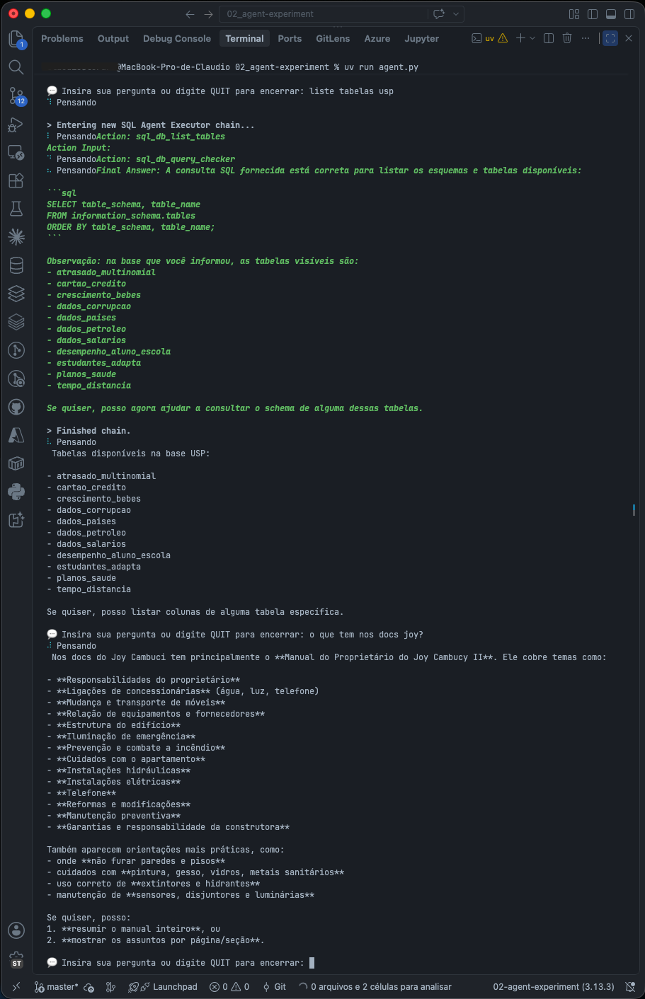
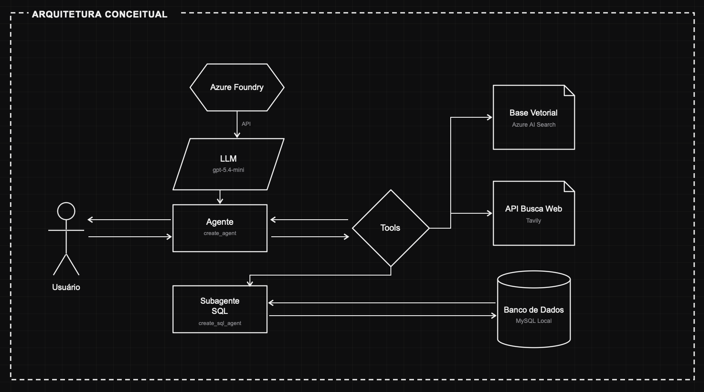

# Agent Experiment02 - Langchain + Az Foundry + Tools

Assistente pessoal de linha de comando construído com **LangChain** + **LangGraph**, usando um LLM hospedado no **Azure AI Foundry** e três ferramentas próprias: busca em base de conhecimento vetorial, busca na web e consulta a banco de dados via sub-agente SQL.

Projeto de estudo do ecossistema LangChain/LangGraph, explorando `create_agent`, ferramentas customizadas, sub-agentes e integração com serviços Azure.



## Sobre o projeto

O `agent.py` sobe um agente conversacional no terminal com memória de sessão. A cada pergunta do usuário, o agente decide — usando o próprio LLM — se responde diretamente ou aciona uma de suas ferramentas:

- consultar uma base de conhecimento vetorial (documentos de um condomínio, via Azure AI Search / Foundry IQ);
- buscar informações atualizadas na web (Tavily);
- consultar um banco de dados MySQL local através de um sub-agente especializado em SQL.

## Arquitetura conceitual



- **Usuário** interage pelo terminal (`agent.py`), em um loop de perguntas e respostas.
- **Agente** (`langchain.agents.create_agent`) orquestra a conversa, com prompt de sistema e memória de sessão (`MemorySaver`).
- **LLM** (`gpt-5.4-mini`) é entregue via **API** pelo **Azure AI Foundry**, autenticado com `DefaultAzureCredential`.
- **Tools** é o roteador de ferramentas do agente, com três ramos:
  - **Base Vetorial** (Azure AI Search) — busca semântica via cliente MCP (`streamable_http`), autenticado com token Azure AD.
  - **API Busca Web** (Tavily) — busca em tempo real na internet.
  - **Subagente SQL** (`create_sql_agent`) — agente dedicado que interpreta a pergunta, gera e executa SQL, e troca dados em ida e volta com o **Banco de Dados** (MySQL local).

## Ferramentas disponíveis

| Ferramenta                  | Arquivo                      | Descrição                                                                            |
| --------------------------- | ---------------------------- | -------------------------------------------------------------------------------------- |
| `search_knowledgebase_05` | `src/retriever_azure.py`   | Busca semântica em base vetorial (Azure AI Search / Foundry IQ) via MCP.              |
| `web_search`              | `src/tavily_web_search.py` | Busca na web em tempo real usando a API da Tavily.                                     |
| `sql_usp`                 | `src/mysql_usp_databse.py` | Aciona um sub-agente SQL (`create_sql_agent`) para consultar o banco de dados MySQL. |

## Stack

- [LangChain](https://github.com/langchain-ai/langchain) (`create_agent`, `create_sql_agent`, `SQLDatabaseToolkit`)
- [LangGraph](https://github.com/langchain-ai/langgraph) (`MemorySaver` como checkpointer de sessão)
- [langchain-azure-ai](https://pypi.org/project/langchain-azure-ai/) (`AzureAIOpenAIApiChatModel`, retrievers)
- [langchain-mcp-adapters](https://pypi.org/project/langchain-mcp-adapters/) (cliente MCP para a base de conhecimento)
- `azure-identity` (`DefaultAzureCredential`)
- `pymysql` + SQLAlchemy (acesso ao MySQL)
- `tavily-python` (busca web)
- `python-dotenv`, `yaspin` (variáveis de ambiente e spinner no terminal)
- Gerenciado com [uv](https://github.com/astral-sh/uv)

## Pré-requisitos

- Python 3.13+
- [uv](https://github.com/astral-sh/uv) instalado
- Conta Azure com acesso ao Foundry configurado e autenticada localmente (`az login`), já que a aplicação usa `DefaultAzureCredential`
- Um índice de busca configurado no Azure AI Search / Foundry IQ (base vetorial)
- MySQL rodando localmente, com um banco de dados `USP` acessível ao usuário configurado
- Chave de API da [Tavily](https://tavily.com/)

## Instalação

```bash
git clone https://github.com/sturaro-ds/langchai-agents-exp02
cd 02_agent-experiment
uv sync
```

## Configuração

Crie um arquivo `.env` na raiz do projeto com as variáveis abaixo:

```bash
FOUNDRY_PROJ_ENDPOINT=   # endpoint do projeto no Azure AI Foundry
MCP_URL_SRCH=            # URL do servidor MCP da base de conhecimento (Foundry IQ)
TAVILY_API_KEY=          # chave de API da Tavily
MYSQL_PASS=              # senha do usuário MySQL usado em src/mysql_usp_databse.py
```

> O acesso ao Azure (LLM e base vetorial) é feito via `DefaultAzureCredential`, então também é necessário estar autenticado localmente com `az login`.

## Uso

```bash
uv run agent.py
```

Digite sua pergunta no prompt do terminal. O agente decide sozinho se responde diretamente ou usa uma das ferramentas disponíveis. Digite `QUIT` para encerrar a sessão.

## Estrutura do projeto

```text
.
├── agent.py                    # ponto de entrada: monta o agente e o loop no terminal
├── src/
│   ├── retriever_azure.py      # ferramenta: busca na base vetorial (Azure AI Search / MCP)
│   ├── tavily_web_search.py    # ferramenta: busca na web (Tavily)
│   └── mysql_usp_databse.py    # ferramenta: sub-agente SQL para o banco MySQL
├── img/                         # imagens usadas neste README
├── pyproject.toml               # metadados do projeto e dependências (uv)
├── uv.lock                      # lockfile de dependências gerado pelo uv
├── requirements.txt             # dependências no formato pip (alternativa ao uv)
├── .python-version              # versão do Python fixada para o projeto (3.13)
├── .env                         # variáveis de ambiente locais (não versionado, ver Configuração)
└── .gitignore
```

## Memória por sessão / não persistida

- A memória de sessão (`MemorySaver`) fica em RAM e usa um `thread_id` fixo — não persiste entre execuções nem separa conversas de usuários diferentes.
- Projeto voltado a estudo/experimentação, não a uso em produção.
